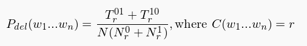

# Abstract
Generate a knowledge-base for Hebrew word-prediction system, based on Google 3-Gram Hebrew dataset, using Amazon Elastic Map-Reduce (EMR). The produced knowledge-base indicates the probability of each word trigram found in the corpus.
 We will build a map-reduce system for calculating the probability of each trigram (w1,w2,w3) found in a given corpus,
  to run it on the Amazon Elastic MapReduce service, and to generate the output knowledge base with the resulted  probabilities.
 The input corpus is the Hebrew 3-Gram dataset of Google Books Ngrams.
 The output of the system is a list of word trigrams (w1,w2,w3) and their probabilities (P(w1w2w3))).
  The list should be ordered:
   1.by w1w2, ascending<br/>
   2.by the probability for w1w2w3, descending.<br/>
   for example:
   ```bash
   קפה נמס עלית 0.6
קפה נמס מגורען 0.4
קפה שחור חזק 0.6
קפה שחור טעים 0.3
קפה שחור חם 0.1
…
שולחן עבודה ירוק 0.7
שולחן עבודה מעץ 0.3
…
```

Probability Function
=========
In this project, we will implement a held out method, named deleted estimation.
 Held out estimators divide the training data (the corpus) into two parts, build initial estimates by doing
  counts on one part, and then use the other pool of held out data to refine those estimates.
    The deleted estimation method, for instance, uses a form of two-way cross validation, as follows:  
   <br/>
   Where:
* N is the number of n-grams in the whole corpus.
* Nr0 is the number of n-grams occuring r times in the first part of the corpus.
* Tr01 is the total number of those n-grams from the first part (those of Nr0) in the second part of the corpus.
* Nr1 is the number of n-grams occuring r times in the second part of the corpus.
* Tr10 is the total number of those n-grams from the second part (those of Nr1) in the first part of the corpus.

Program flow
=========
The program consist of 5 Map-reduce steps as follows:
1. split-to-gropus- at this step we will read the entire corpus and split it to 2 groups with
  probability of 0.5 and count how many times each word appear in the first and the
  second group.
2. calculate-vars - at this step we will calculate the values of n0,n1,tr01,t10 for any possible
  value of r.
3. merge-groups-vars - at this step we will join the outputs of step 1 and step 2, so
  that the output of this step will consist rows of the form: 3gram    x   y
  where x is nr0/nr1/tr01/tr10
  and y is the corresponding value.
4. calculate-prob- at this step we will calculate the desired probability for 
 each 3gram in the corpus.
5. sort - at this step we will sort the results according to
  the sort creteria mentioned above.

How to run
=========
Please make sure you have maven and Amazon CLI installed on your machine.<br/>
 1.Clone the projet.<br/>
2.Update the credentials file on your machine with your AWS credentials.<br/>
3.Create bucket on s3.<br/>
 3.Open the file AppConfig.java and change the bucketname variable to the<br/>
   hold the adress of the bucket you created.<br/>
 4.Make a jar file- in the project folder run the command<br/>
   "mvn package". This will create 2 jar files at Target folder.<br/>
 5.Upload aws-jar-with-dependencies.jar to the bucket.<br/>
 6.Go to Target folder and run: "Java -jar local-jar-with-dependencies.jar"<br/>
   *The output of the program will be saved in the bucket<br/>
     under the folder output4.<br/>


